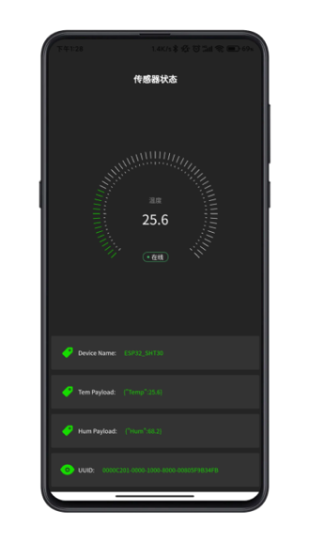
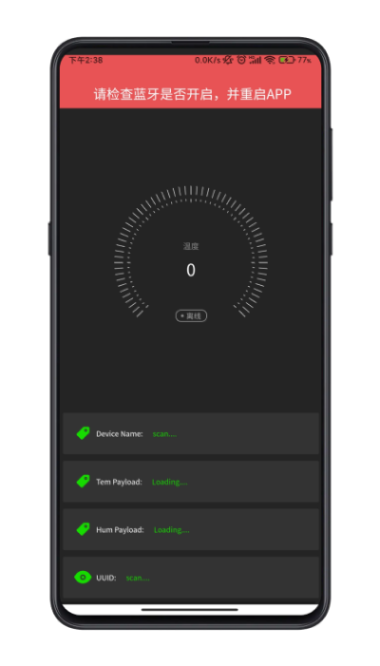

## ESP32 ENV uniapp

ESP32 Send sensor data through BLE broadcast, UNI APP scans to obtain broadcast frames, and obtains and displays temperature and humidity data in a non-connected way。

```cpp

├─Folder
│  ├─ESP32-ENV-BLE-ADV  //ESP32 PlatformIO Project
│  ├─UNI-APP-BLE-SCAN  //uniapp Project

```




## Reference

- [uniapp-component best-gauge](https://github.com/MrChenYZ/best-gauge)
